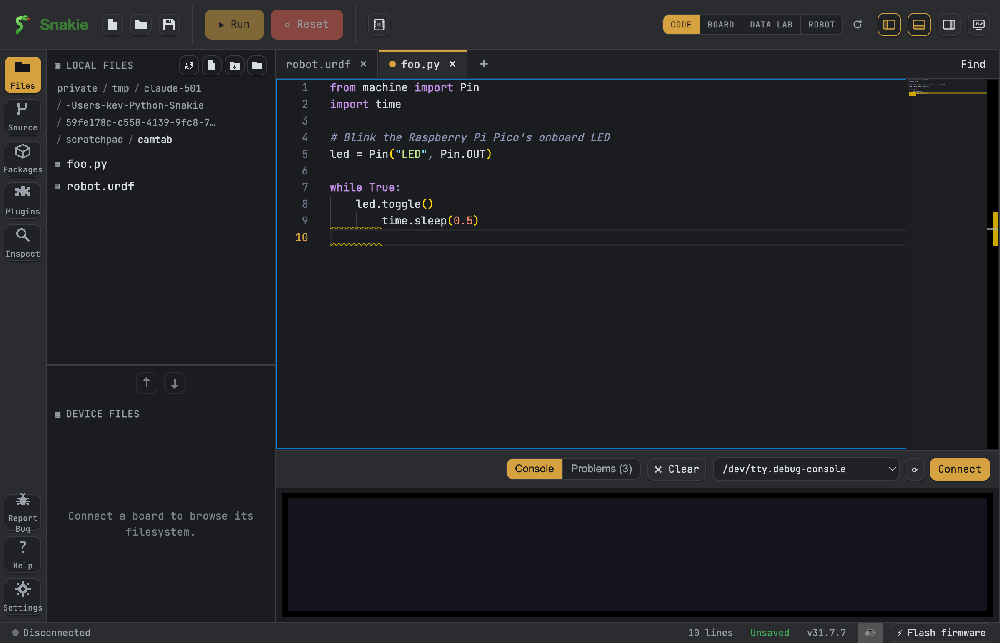

# Install Snakie

This page shows you how to put Snakie on your computer. Snakie is a friendly code editor for MicroPython — a small version of the Python programming language that runs on tiny computer boards. Pick your computer type below and follow the steps.

## Get the installer

Snakie is a free download. Every version lives on its **Releases** page on GitHub (the website where the app's code is kept).

1. Open the releases page: [github.com/kevinmcaleer/Snakie/releases/latest](https://github.com/kevinmcaleer/Snakie/releases/latest).
2. Scroll to the **Assets** list. This is where the download files are.
3. Download the file that matches your computer (the table below tells you which one).

!!! tip "Not sure which file?"
    An *installer* is a file that puts the app on your computer for you. Each type of computer needs its own installer, so grab the one made for yours.

| Your computer | Download this file |
| --- | --- |
| Windows (most PCs) | `Snakie-Setup-<version>.exe` |
| Mac with Apple Silicon (M1/M2/M3 and newer) | the `arm64` `.dmg` |
| Mac with an Intel chip (older Macs) | the Intel `.dmg` |
| Linux PC | `.AppImage` or `.deb` (x64) |
| Raspberry Pi (64-bit Pi OS) | the `arm64` `.AppImage` |

!!! note "Which Mac do I have?"
    Click the Apple menu in the top-left corner, then **About This Mac**. It tells you whether you have Apple Silicon or an Intel chip.

## Install it

=== "Windows"

    1. Double-click the `Snakie-Setup-<version>.exe` file you downloaded.
    2. If Windows shows a blue "Windows protected your PC" box, click **More info**, then **Run anyway**. This appears because Snakie is a newer app.
    3. Follow the setup steps. When it finishes, open **Snakie** from your Start menu.

=== "macOS"

    1. Double-click the `.dmg` file to open it.
    2. Drag the **Snakie** icon onto the **Applications** folder.
    3. Open **Applications** and double-click **Snakie**. The first time, right-click the icon and choose **Open**, then **Open** again to let macOS trust it.

=== "Linux"

    **AppImage** (works on most Linux PCs):

    1. Make the file runnable. Right-click it, choose **Properties**, and tick *Allow executing file as program* — or run in a terminal:
       ```bash
       chmod +x Snakie-<version>.AppImage
       ```
    2. Double-click the file to launch Snakie.

    **.deb** (for Debian/Ubuntu):
    ```bash
    sudo apt install ./Snakie-<version>.deb
    ```

=== "Raspberry Pi"

    Use the **arm64 AppImage** on 64-bit Raspberry Pi OS.

    1. Make it runnable:
       ```bash
       chmod +x Snakie-<version>-arm64.AppImage
       ```
    2. Double-click it to open Snakie.

    An AppImage does not add itself to the menu. Snakie ships a small helper script that adds it for you, under the **Programming** menu:

    ```bash
    ./scripts/install-linux-menu.sh ~/Downloads/Snakie-<version>-arm64.AppImage
    ```

    !!! tip
        Run the helper again after you download a newer version so the menu points at the new file. To remove the entry, run it with `--uninstall`.



## Snakie keeps itself up to date

Good news — you do not need to reinstall every time. When you open Snakie and a newer version is available, it tells you inside the app so you can update with a click.

## What next?

- New to tiny boards? Read [What is MicroPython?](../explanation/what-is-micropython.md) for a gentle overview.
- Ready to explore the app? Head to [Your first steps](first-steps.md).
- Want to make a light blink straight away? Try the [Blink tutorial](../tutorials/blink.md).

Welcome to Snakie — have fun building things!
