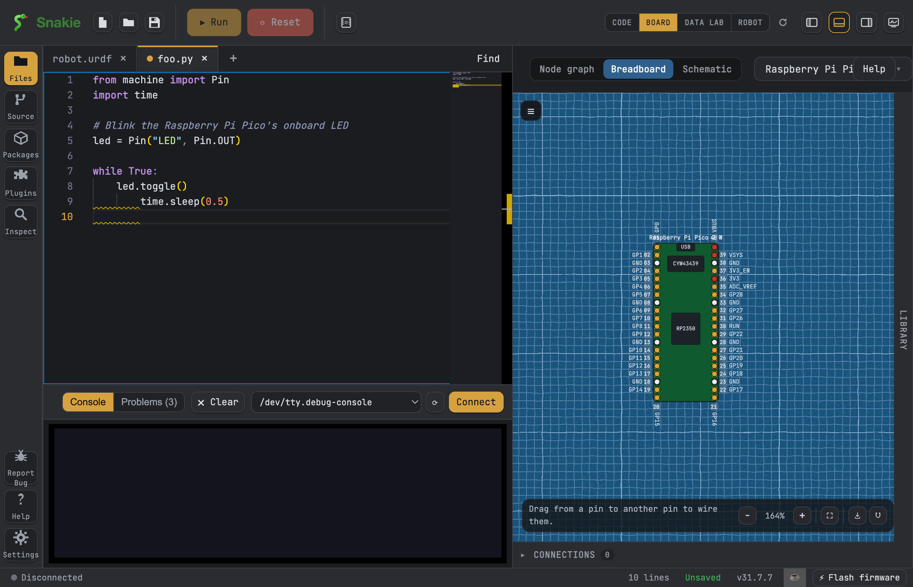

# Use the Board View

The Board View draws a picture of your real MicroPython board and lights up the pins your code uses. It is a fun way to see your program come to life before you even wire anything up.

!!! note "What is a pin?"
    A **pin** is one of the little metal connection points on your board. Your code turns pins on and off to blink lights, read sensors, and drive motors.

## Open the Board View

1. Open or write a MicroPython file that uses some pins.
2. Open the **Board View** from Snakie's activity bar (the strip of icons down the side).
3. Snakie reads your code and draws the matching board, with the pins you use highlighted.

Snakie already knows lots of boards, like the Raspberry Pi Pico 2 W, ESP32, and several Pimoroni boards. See the full list on the [Supported boards](../reference/supported-boards.md) page.



Here is a tiny program to try. It blinks the onboard LED:

```python
from machine import Pin
import time

led = Pin("LED", Pin.OUT)

while True:
    led.toggle()
    time.sleep(0.5)
```

!!! tip
    Curious how Snakie knows which pins you use? It scans your code for pin numbers and names. Read [How the Board View reads your code](../explanation/board-view.md) to learn more.

## See connections in the node graph

The **node graph** shows every connection as a card joined by a line. Each connection is colour-coded by type, so you can tell them apart at a glance:

| Type | What it means |
| --- | --- |
| Input | The pin reads a value in (like a button) |
| Output | The pin sends a value out (like an LED) |
| PWM | A pin that dims or fades, or drives motors |
| ADC | Reads a smooth, changing value (like a dial) |
| I2C / SPI | Ways to talk to sensors and screens |
| PIO | Special fast pin control on some boards |

When your board is connected and running, the graph can show **live pin values** too.

## Use it by touch

On a touchscreen (like an iPad), the Board View works with your fingers:

- **Tap** the board or a part to see its pin chips (the little labels that say what each pin can do). Tap somewhere else to hide them again.
- **Drag** a wire from pin to pin with one finger.
- **Pinch** with two fingers to zoom in and out; drag with one finger to pan.

!!! note "In the browser too"
    On [app.snakie.org](https://app.snakie.org), the board icon in the toolbar pops
    the Board View out into its **own browser window**, just like the desktop app —
    handy for putting code on one side of the screen and the board on the other.

## Zoom, rotate, and export

You can move around the drawing and save it to share:

- **Zoom** in and out to see fine detail or the whole board.
- **Rotate** the board so it matches how it sits on your desk.
- **Export** a picture as **SVG**, **PNG**, or **PDF** to pop into a report, a blog post, or your homework.

!!! example "📸 Screenshot"
    _Show: the export menu with SVG, PNG, and PDF options._

## Switch between views

The Board View can show your project in three ways. Pick the one that helps you most:

- **Node graph** — a clean map of pins and connections by type.
- **Breadboard** — parts and your board laid out like a real breadboard, with wire "noodles" between them.
- **Schematic** — a tidy diagram with neat, straight lines (red for power, white for ground, colours for signals).

To add parts and draw the wires in the Breadboard and Schematic views, see [Add and wire parts](add-and-wire-parts.md).

## Make a custom board

Using a board Snakie doesn't know yet? Open the **Board Creator** to design your own. You place the pins and give them names, and your new board becomes available in the Board View just like the built-in ones.

!!! tip
    Take your time naming pins clearly. Good names make the node graph much easier to read later.

## Where to go next

- [How the Board View reads your code](../explanation/board-view.md) — the story behind the highlights.
- [Add and wire parts](add-and-wire-parts.md) — build a full circuit on screen.
- [Supported boards](../reference/supported-boards.md) — check your board is in the list.
- [Watch the Board, Breadboard and Schematic views in Kev's Snakie
  tour](https://www.kevsrobots.com/blog/what-if-building-robots-with-code-was-actually-easy.html#the-board-breadboard-and-schematic-viewer)
  — see the visual workflow demonstrated on real hardware.
