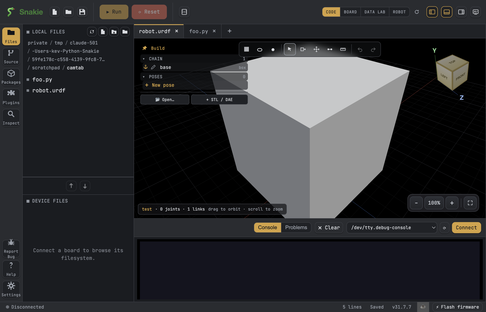

# Build a robot in 3-D

The Robot View is a 3-D space where you can build a robot from simple blocks or your own 3-D shapes, join the pieces together, and pose them. This guide walks you through every task, step by step.

!!! tip "New here?"
    If this is your first robot, start with the [First robot tutorial](../tutorials/first-robot.md). This page is the deeper how-to. To understand *why* the Robot View works the way it does, see [How the Robot View works](../explanation/robot-view.md).

## Open Robot mode and start a new robot

1. Open the **Robot View** window.
2. Choose **New robot** to start with an empty scene. You will see a 3-D grid you can spin and zoom with your mouse.

A robot is made of **parts** (the shapes) held together by **joints** (the connections between shapes). You will build both.

## Add a shape

You can build from **primitive blocks** (basic shapes) or bring in your own model.

- To add a primitive, pick a **block**, **cylinder**, or **sphere** from the toolbar. A *primitive* is a plain, ready-made shape you can resize.
- To use your own model, import an **STL mesh**. An *STL* is a common 3-D model file, the kind you export from CAD or download for 3-D printing.

You can also drop in a part from your [Parts Library](add-and-wire-parts.md) that carries a 3-D mesh — it appears in the scene ready to join.

## Colour a part

1. Click a part to select it.
2. Use the **Color** control to pick a colour.

This is just for looks, so make each part a colour that helps you tell them apart.

## Join two parts with Add Joint

A *joint* connects two parts so they move together. The first part you pick is the **parent** and the second is the **child** (the child hangs off the parent).

1. Choose **Add Joint**.
2. Click a point on the **first** part. As your mouse moves, the point **snaps** to helpful spots: corners, edges, and hole centres. Snapping means it jumps to the exact spot so you do not have to be perfectly accurate.
3. Click a point on the **second** part the same way.
4. The two parts join at those points.

!!! tip "Lock a snap with Shift"
    Sometimes the spot you want — like a hole centre — sits over empty space, so the snap keeps jumping away. **Hold SHIFT to lock the highlighted snap**, then click. The point stays put even over a gap.

!!! example "📸 Screenshot"
    _Show: Add Joint mid-action, with a hole centre highlighted and a Shift-lock indicator._

## Read the Chain view and re-parent

The **Chain view** is an indented list that shows the parent → child structure of your robot, so you can see what is attached to what.

- Read it top to bottom: each indented item is a child of the item above it.
- To move a part under a different parent, use its **Attaches to** dropdown and pick the new parent.

## Break a joint to free a part

To detach a part **without deleting the part itself**, delete the **joint**, not the part. The part stays in your scene, now free to re-join somewhere else.

!!! warning "Delete the joint, not the part"
    Deleting the part removes the shape entirely. If you only want to disconnect it, delete the joint.

## Pose the robot

Once parts are joined, you can move them:

1. Select a joint or open its controls.
2. Drag the **joint sliders** to bend, turn, or slide the child part.

You can save poses and preview a saved pose in the **docked mini viewer**, a small window that shows the robot in that pose without disturbing your main scene.

!!! example "📸 Screenshot"
    _Show: joint sliders posing an arm, with the docked mini viewer previewing a saved pose._

## Blow it apart — the exploded view

An **exploded view** is a drawing style where a machine's parts float apart so you can see how they fit together — you've probably seen one in flat-pack furniture instructions.

1. Click the **💥** button on the zoom toolbar. A small panel opens.
2. Drag the **separation slider** — the parts glide outward from the middle of the robot, and back together again.
3. Press **▶** to play a smooth out-and-back explosion animation. Tick **orbit** and the camera flies once around the robot while it happens.
4. Press **🎬** to record the animation as a video file you can share — great for showing off how your robot goes together. (On computers that can't record video, Snakie saves an animated GIF instead.)

!!! example "📸 Screenshot"
    _Show: the exploded-view panel open, with a robot's parts separated._

## Export a clean URDF

Your robot's 3-D model is described by a **URDF** file (a standard text format for robot models — see [What is URDF?](../explanation/robot-view.md)). Press **⬇ Export URDF** in the build panel to write a clean, tidy copy of the model into your project's `urdf/` folder — handy for sharing, or for using your robot in other tools that read URDF.

## Make it move — servos and animation

Posing by hand is just the start. You can connect a real **servo** to a joint so a running program moves the model, chain poses into **sequences** and **puppet controls**, and test it all live from the **Poses bench**.

That all lives in its own guide: [Bind servos and animate (Motion Studio)](motion-studio.md).

## Keep your robot self-contained

STL meshes referenced by a robot live in a `meshes/` folder next to your project. When Snakie offers to **copy meshes into the project**, say yes — this keeps the models and the robot together, so nothing goes missing if you move or share the folder.

Your work is saved to a `robot.yml` project file. To learn what each field means, see the [robot.yml reference](../reference/robot-yml.md).

!!! note "Next steps"
    Ready to wire your robot's electronics? Head to [Add and wire parts](add-and-wire-parts.md).
